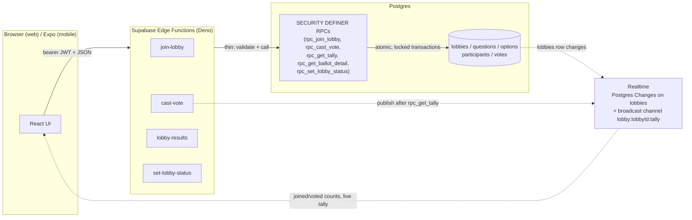

# Votero — Case Study

A QR-code group voting app — scan a code, vote, watch results update live. The product is
deliberately simple to use; what's underneath it isn't. This is a walkthrough of the engineering
decisions worth knowing about, for anyone evaluating this as a portfolio project rather than just
clicking through the demo.

## Architecture at a glance

Thin Edge Functions validate input and call Postgres functions that do the actual atomic work —
locking primitives live in Postgres, not Deno. `rpc_create_lobby` is the one exception: a plain
RPC with no Edge Function wrapper, since it's a single-statement insert with no race to guard.

## Decisions worth walking through

### 1. Ballot anonymity is enforced by *which function you're allowed to call*, not a row filter

The `votes` table has **zero client-facing RLS policies and zero table grants — default deny in
both directions.** This wasn't the obvious choice: RLS can filter *rows*, but it can't express "you
may see an aggregate count but never the individual row." Any policy permissive enough to let a
client compute its own tally is also permissive enough to leak the exact voter→option linkage that
anonymous ballot mode has to hide.

So every read and write to `votes` goes through a `SECURITY DEFINER` Postgres function instead:
`rpc_cast_vote` for writes, and two structurally distinct read shapes — `rpc_get_tally` (a pure
aggregate, no identity, always safe to expose) and `rpc_get_ballot_detail` (participant→option
linkage, internally gated to `ballot_mode = 'open' AND creator_id = auth.uid()`, else `FORBIDDEN`).
Splitting these into two separate functions rather than one parameterized one means the
identity-carrying shape **structurally cannot be requested** except by the one caller allowed to
see it — the anonymity guarantee lives in which function exists, not in a runtime `if`.

### 2. Rate limiting: a real, explicitly-bounded tradeoff, not a false sense of security

Every participant — including anonymous voters — authenticates via Supabase anonymous auth, so
`auth.uid()` is always present. That meant a per-identity rate limiter (a generic hit-log table
plus a `rpc_check_rate_limit(action, max_count, window)` function, called as the first statement inside
`rpc_create_lobby`/`rpc_join_lobby`/`rpc_cast_vote`) could be added inside the *existing* RPCs —
no new Edge Function, no IP capture needed.

The honest tradeoff, stated up front rather than glossed over: a determined abuser could rotate
anonymous sessions to reset their own limit. That's accepted, not solved — the same category of
limitation this app already has for "one vote per person" (session-based, best-effort, not
cryptographically enforced). The rate limiter's actual job is stopping accidental retry storms and
casual abuse, which it does; knowing what it *doesn't* do is part of the design, not a gap that
was missed.

### 3. A real accessibility bug, found by tooling and fixed by measurement, not guesswork

Adding `@axe-core/playwright` as an automated accessibility check surfaced a genuine WCAG AA
failure that had shipped silently: white text on the primary button's brand color measured a
3.21:1 contrast ratio against a 4.5:1 requirement. Rather than picking a new color by eye, the fix
was to compute the actual contrast ratio for every shade already in the palette and pick the
darkest one that passed — `brand-700` at 5.15:1 — so the fix is "use the existing brand color one
step darker," not a new, disconnected shade. The regression test that caught it stayed in the
suite afterward, with the specific check re-enabled (not left disabled) once the real fix landed,
so it can't silently regress again.

### 4. Load-testing found the real bottleneck — which wasn't the one that seemed obvious

`rpc_cast_vote` and `rpc_join_lobby` both take a row lock (`select ... for update`) on the `lobbies`
row for the whole transaction, so every vote and join on the *same* lobby fully serializes. That's
the theoretical bottleneck for "everyone votes at the same instant" — so it's what a load test
should measure. A small Node script (no browser, no external load-testing tool — just concurrent
`fetch` calls against the real Edge Functions, since spinning up dozens of real browser contexts
would make Playwright's own overhead the actual bottleneck) confirmed **100 concurrent voters land
cleanly**: sub-second wall-clock time, zero errors, zero lost votes.

Pushing to 300 concurrent voters *did* fail — but not at the lock. It failed earlier, during the
burst of 300 simultaneous anonymous sign-ins, with connection resets from the local auth service.
The assumption going in was "the database lock is the ceiling" — the actual ceiling, at least
locally, was somewhere else entirely. That's the value of measuring instead of assuming: the
interesting finding wasn't the one that was expected.

## Stack

| Layer | Choice |
|---|---|
| Monorepo | Turborepo + pnpm workspaces (`apps/web`, `apps/mobile`, shared `packages/*`) |
| Web | Next.js (App Router) |
| Mobile | Expo + Expo Router (scaffolded, not yet built out — see below) |
| Backend | Supabase — Postgres, Auth (incl. anonymous sessions), Realtime, Edge Functions (Deno), RLS |
| Server state | TanStack Query — one hook per operation |
| Testing | Playwright (26 committed e2e tests), `@axe-core/playwright`, a standalone Node load-test script |
| CI/CD | GitHub Actions — lint/type-check/build + the full e2e suite against a real local Supabase stack, on every push |
| Observability | Sentry (error monitoring), Vercel Analytics (funnel events) |

Full detail: [`docs/TECH_STACK_PLAYBOOK.md`](./TECH_STACK_PLAYBOOK.md) (project-agnostic writeup
of the same patterns, for reuse elsewhere) and [`docs/ARCHITECTURE.md`](./ARCHITECTURE.md) (the
complete schema/RLS/build-order record this case study draws from).

## What's deliberately not built yet

- **Native mobile** — `apps/mobile` is still the bare Expo scaffold; all the backend/business logic
  it would consume already exists in `packages/shared`, but the native UI hasn't been built.
- **Self-serve account deletion** — currently a manual request, disclosed honestly in the Privacy
  Policy rather than left unaddressed.
- **Real assistive-tech testing** — the accessibility pass is automated (axe scans, `jsx-a11y`
  lint rules, a real keyboard-only focus-trap test) and caught genuine bugs, but that's not the
  same as testing with a real NVDA/VoiceOver user. Flagged as a known gap, not claimed as done.
